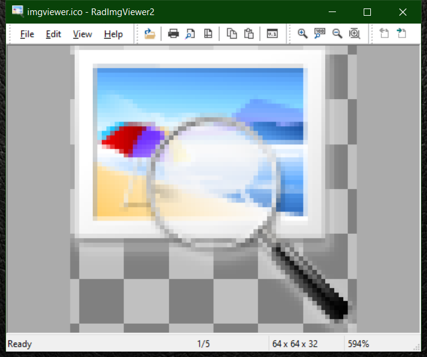

<!--  RadImgViewer2 -->
 RadImgViewer2
==========

This is a utility to quickly view images. It uses [WIC](https://docs.microsoft.com/en-us/windows/win32/wic/-wic-about-windows-imaging-codec) for loading. I wrote
this mainly because things like ACDSee are too expensive.

